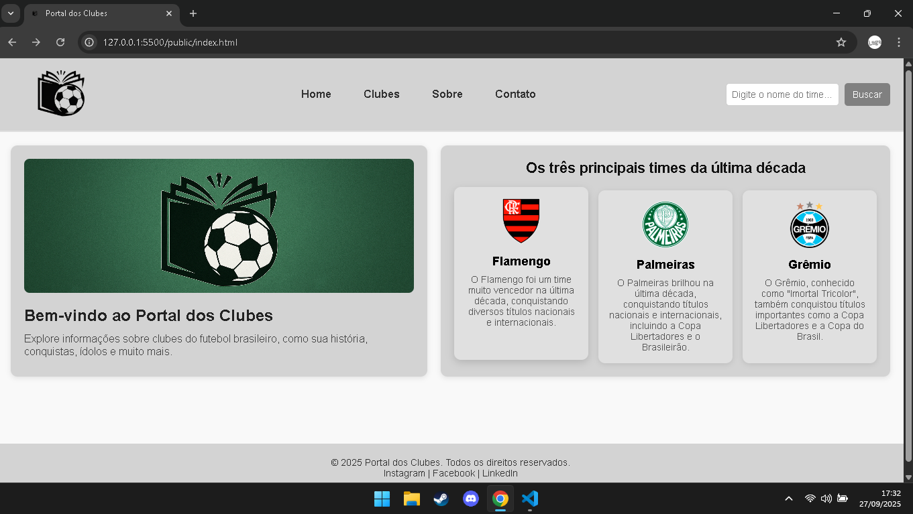
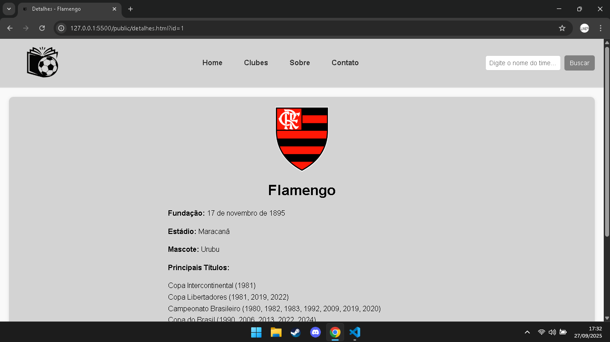

# Trabalho Prático 05 - Semanas 7 e 8

**Páginas de detalhes dinâmicas**

Nessa etapa, vamos evoluir o trabalho anterior, acrescentando a página de detalhes, conforme o  projeto escolhido. Imagine que a página principal (home-page) mostre um visão dos vários itens que existem no seu site. Ao clicar em um item, você é direcionado pra a página de detalhes. A página de detalhe vai mostrar todas as informações sobre o item do seu projeto. seja esse item uma notícia, filme, receita, lugar turístico ou evento.

Leia o enunciado completo no Canvas. 

**IMPORTANTE:** Assim como informado anteriormente, capriche na etapa pois você vai precisar dessa parte para as próximas semanas. 

**IMPORTANTE:** Você deve trabalhar e alterar apenas arquivos dentro da pasta **`public`,** mantendo os arquivos **`index.html`**, **`styles.css`** e **`app.js`** com estes nomes, conforme enunciado. Deixe todos os demais arquivos e pastas desse repositório inalterados. **PRESTE MUITA ATENÇÃO NISSO.**

## Informações Gerais

- Nome: Matheus Lage da Silva
- Matricula: 903591
- Proposta de projeto escolhida: Portal dos Clubes
- Breve descrição sobre seu projeto: O projeto tem como ideia criar um site sobre os clubes de futebol do Brasil. Nele, será possível conhecer a Biografia(fundação, estádio, mascote, cidade, escudo), os títulos mais importantes, seus maiores ídolos e outras curiosidades. A proposta é reunir tudo de forma simples, para que estusiastas de futebol possam explorar e aprender mais sobre os clubes brasileiros.

## Print da Home-Page



## Print da página de detalhes do item



## Cole aqui abaixo a estrutura JSON utilizada no app.js

```javascript
const clubes = [
  {
    "id": 1,
    "nome": "Flamengo",
    "escudo": "./images/escudos/Flamengo.png",
    "descricao_curta": "O Flamengo foi um time muito vencedor na última década, conquistando diversos títulos nacionais e internacionais.",
    "fundacao": "17 de novembro de 1895",
    "estadio": "Maracanã",
    "mascote": "Urubu",
    "principais_titulos": ["Copa Intercontinental (1981)", "Copa Libertadores (1981, 2019, 2022)", "Campeonato Brasileiro (1980, 1982, 1983, 1992, 2009, 2019, 2020)", "Copa do Brasil (1990, 2006, 2013, 2022, 2024)"],
    "idolos": ["Zico", "Gabigol", "Arrascaeta"]
  },
  {
    "id": 2,
    "nome": "Palmeiras",
    "escudo": "./images/escudos/Palmeiras.png",
    "descricao_curta": "O Palmeiras brilhou na última década, conquistando títulos nacionais e internacionais, incluindo a Copa Libertadores e o Brasileirão.",
    "fundacao": "26 de agosto de 1914",
    "estadio": "Allianz Parque",
    "mascote": "Periquito e Porco",
    "principais_titulos": ["Copa Libertadores (1999, 2020, 2021)", "Campeonato Brasileiro (1960, 1967(1), 1967(2), 1969, 1972, 1973, 1993, 1994, 2016, 2018, 2022, 2023)", "Copa do Brasil (1998, 2012, 2015, 2020)"],
    "idolos": ["Ademir da Guia", "Marcos", "Dudu"]
  },
  {
    "id": 3,
    "nome": "Grêmio",
    "escudo": "./images/escudos/Gremio.png",
    "descricao_curta": "O Grêmio, conhecido como 'Imortal Tricolor', também conquistou títulos importantes como a Copa Libertadores e a Copa do Brasil.",
    "fundacao": "15 de setembro de 1903",
    "estadio": "Arena do Grêmio",
    "mascote": "Mosqueteiro",
    "principais_titulos": ["Copa Intercontinental (1983)", "Copa Libertadores (1983, 1995, 2017)", "Campeonato Brasileiro (1981, 1996)", "Copa do Brasil (1989, 1994, 1997, 2001, 2016)"],
    "idolos": ["Renato Gaúcho","Geromel", "Luan"]
  }
];